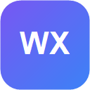

<div align="center">
  
  <h1>WX Shot</h1>
  <p><strong>Seç. Gizle. İşaretle. Paylaş.</strong></p>
  <p>Modern, hızlı ve gizlilik odaklı tarayıcı ekran görüntüsü aracı.</p>

  <p>
    
    
    
    
  </p>

  <p>
    
    
    
    
  </p>
</div>

---

## WX Shot nedir?

WX Shot; sekmenin görünen alanından seçim yapabilen veya kaydırılabilir sayfanın tamamını yakalayabilen, sonucu tarayıcıdan ayrılmadan düzenleyip dışa aktarabilen bir WebExtension'dır. Görüntüler bir sunucuya yüklenmez; yakalama, birleştirme, çizim, hassas bilgi gizleme ve dışa aktarma işlemleri cihazda yapılır.

## v1.3.0 yenilikleri

| # | Özellik | Açıklama |
|---:|---|---|
| 1 | Tam sayfa yakalama | Uzun sayfayı kareler halinde yakalar, sabit öğeleri tekrar etmeden tek görüntüde birleştirir |
| 2 | Bulanıklaştırma ve pikselleştirme | Seçilen dikdörtgen alanı geri alınabilir bir efekt katmanında gizler |
| 4 | Yakınlaştırma ve kaydırma | `%25–%400` aralığında yakınlaştırma; `Ctrl/Cmd + tekerlek`, orta tuş veya `Space + sürükle` desteği |
| 7 | Gelişmiş şekil stilleri | Dolgu, saydamlık, kesik çizgi, gölge; klasik, çift ve nokta ok ucu |
| 10 | Çoklu dışa aktarma | PNG, JPEG ve WebP; `%100`, `%75` veya `%50` çıktı ölçeği; JPEG/WebP kalite ayarı |
| 12 | Yerel son çekimler | Son altı dışa aktarmanın sıkıştırılmış önizlemesini yalnızca tarayıcı depolamasında tutar |
| 13 | Sağ tık menüsü | “Alan seç” ve “Tam sayfayı yakala” komutlarını sayfa menüsüne ekler |
| 14 | Akıllı gizleme | Sayfadaki e-posta, telefon ve kart numarası benzeri metinleri yerel olarak bulup pikselleştirir |
| 15 | Erişilebilirlik ve dil | Türkçe/İngilizce arayüz, klavye odağı, ARIA etiketleri, yüksek kontrast ve azaltılmış hareket desteği |

## Tüm özellikler

- Fareyle serbest alan seçimi ve anlık piksel ölçüsü
- Kaydırılabilir uzun sayfaların tek görüntü halinde yakalanması
- Yumuşatılmış, gecikmesi azaltılmış ve kalem basıncına duyarlı çizim
- Kalem, vurgulayıcı, çizgi, ok, dikdörtgen, elips, metin ve silgi
- Bulanıklaştırma, pikselleştirme ve akıllı hassas bilgi gizleme
- Renk, kalınlık, saydamlık, dolgu, kesik çizgi, gölge ve ok ucu ayarları
- Geri al/yinele; eylem tabanlı ve tahribatsız düzenleme
- Yakınlaştırma, sığdırma ve çalışma alanını kaydırma
- PNG/JPEG/WebP ve üç çıktı ölçeği
- Panoya PNG kopyalama ve işletim sisteminin **Farklı kaydet** penceresi
- Son altı çıktının yerel geçmişi
- Eklenti düğmesi, klavye kısayolu, `PrtSc` ve sağ tık menüsü
- Türkçe ve İngilizce yerelleştirme
- Tek ZIP, tek kaynak ağacı ve tek `manifest.json`

## Akıcı çizim motoru

WX Shot 1.3.0, çizim sırasında görülen takılmayı azaltmak için üç ayrı düzenleme katmanı kullanır: efekt, kalıcı çizim ve canlı önizleme. İşaretçi hareketleri ekran yenileme hızında gruplanır; tarayıcının birleştirilmiş giriş noktaları değerlendirilir ve çizgi noktaları işlem sonunda sadeleştirilir. Kalem ve silgi, her harekette bütün geçmişi yeniden çizmez. Büyük görüntülerde düzenleme katmanı otomatik olarak en fazla 3200 px kenar/8 MP çalışma yüzeyine uyarlanır; dışa aktarım ana görselin seçilen çözünürlüğünde oluşturulur.

## Kurulum

### Paketi hazırlayın

1. `WX-Shot-Universal-v1.3.0.zip` dosyasını indirin.
2. ZIP'e sağ tıklayıp **Tümünü ayıkla** seçeneğini kullanın.
3. Seçilecek klasörde doğrudan `manifest.json`, `src`, `assets` ve `_locales` bulunduğunu doğrulayın.

> ZIP dosyasını doğrudan paketlenmemiş eklenti olarak seçmeyin; önce klasöre çıkarın.

### Brave

1. `brave://extensions/` adresini açın.
2. Sağ üstten **Geliştirici modu** seçeneğini açın.
3. **Paketlenmemiş öğe yükle** düğmesine basın.
4. İçinde `manifest.json` bulunan klasörü seçin.
5. Normal bir web sayfasını yenileyip WX Shot'u araç çubuğuna sabitleyin.

### Google Chrome

1. `chrome://extensions/` adresini açın.
2. **Geliştirici modu** seçeneğini açın.
3. **Paketlenmemiş öğe yükle** ile aynı Universal klasörü seçin.

### Microsoft Edge

1. `edge://extensions/` adresini açın.
2. **Geliştirici modu** seçeneğini açın.
3. **Paketlenmemiş öğe yükle** ile aynı Universal klasörü seçin.

### Opera, Opera GX ve Vivaldi

Opera'da `opera://extensions/`, Vivaldi'de `vivaldi://extensions/` sayfasını açın; geliştirici modunu etkinleştirip aynı klasörü paketlenmemiş eklenti olarak yükleyin.

### Firefox

1. `about:debugging#/runtime/this-firefox` adresini açın.
2. **Geçici Eklenti Yükle** düğmesine basın.
3. Universal klasördeki `manifest.json` dosyasını seçin.

Geçici kurulum Firefox yeniden başlatılınca kaldırılır. Kalıcı dağıtım için Mozilla Add-ons imzası gerekir.

### Safari

Safari dağıtımı macOS ve Xcode ile bir uygulama eklentisine dönüştürülmelidir:

```sh
xcrun safari-web-extension-packager /WX-Shot-Universal-klasoru
```

Oluşan Xcode projesi Apple geliştirici kimliğiyle imzalanır. Safari'nin kısayol ve bağlam menüsü davranışları sürüme göre ayrıca doğrulanmalıdır.

## Kullanım

### Alan yakalama

1. Eklenti düğmesine basın, `Alt + Shift + S` kullanın veya sayfaya sağ tıklayıp **WX Shot: Alan seç** deyin.
2. Fareyle istediğiniz alanı sürükleyin.
3. Araçlarla düzenleyin.
4. **Kopyala** veya **Farklı kaydet** seçeneğini kullanın.

### Tam sayfa yakalama

`Alt + Shift + F` kullanın veya sayfaya sağ tıklayıp **WX Shot: Tam sayfayı yakala** deyin. WX Shot, tarayıcının yakalama kotasına uymak için uzun sayfayı kontrollü aralıklarla kaydırır ve sonunda editörü açar. İşlem sırasında sekmeyi değiştirmeyin veya sayfayı kaydırmayın.

### Akıllı gizleme

Editörde **Akıllı gizle** düğmesine basın. WX Shot, yakalama öncesinde sayfa metninden algıladığı e-posta, telefon ve kart numarası benzeri alanları pikselleştirir. Tarayıcı yerel `TextDetector` özelliği sağlıyorsa görüntü tabanlı metin algılaması da denenir. Desteklenmeyen tarayıcılarda görselin içine gömülü yazılar otomatik bulunamayabilir; bu alanlarda manuel **Pikselleştir** veya **Bulanıklaştır** aracını kullanın.

## Araçlar ve kısayollar

| İşlem | Kısayol | Açıklama |
|---|---:|---|
| Alan yakala | `Alt + Shift + S` | Görünen sekmeden alan seçimi başlatır |
| Tam sayfa yakala | `Alt + Shift + F` | Kaydırılabilir sayfanın tamamını yakalar |
| Kalem | `P` | Yumuşatılmış serbest çizim |
| Vurgulayıcı | `H` | Yarı saydam geniş işaretleme |
| Çizgi | `L` | `Shift` ile 45° açı sabitleme |
| Ok | `A` | `Shift` ile 45° açı sabitleme |
| Dikdörtgen | `R` | `Shift` ile kare |
| Elips | `O` | `Shift` ile daire |
| Bulanıklaştır | `B` | Dikdörtgen alana bulanıklık uygular |
| Pikselleştir | `X` | Dikdörtgen alanı mozaikler |
| Metin | `T` | Görüntüye yazı ekler |
| Silgi | `E` | Eklenen çizim ve metinleri siler |
| Geri al/yinele | `Ctrl/Cmd + Z` / `Ctrl/Cmd + Shift + Z` | Son eylemi yönetir |
| Yakınlaştır | `Ctrl/Cmd + tekerlek` | Çalışma alanını yakınlaştırır/uzaklaştırır |
| Kaydır | `Space + sürükle` veya orta tuş | Yakınlaştırılmış görselde gezinir |
| Çıkış | `Esc` | Seçimi veya editörü kapatır |

`PrtSc`, web sayfası odaktayken alan yakalamayı başlatmayı dener. İşletim sistemi ekran alıntısı uygulaması bu tuşu önce yakalayabildiği için eklenti kısayolu daha güvenilirdir.

## İzinler ve gizlilik


| İzin | Neden gerekli? |
|---|---|
| `activeTab` | Kullanıcının başlattığı yakalamada etkin sekmeye erişmek |
| `clipboardWrite` | Sonucu PNG olarak panoya yazmak |
| `contextMenus` | Alan ve tam sayfa komutlarını sağ tık menüsüne eklemek |
| `downloads` | Dosyayı kullanıcının seçtiği konuma kaydetmek |
| `storage` | En fazla altı sıkıştırılmış geçmiş önizlemesini yerel tutmak |
| `<all_urls>` | Normal web sayfalarında seçim arayüzü, `PrtSc` ve tam sayfa akışını çalıştırmak |

WX Shot'ta ağ isteği, hesap, telemetri, reklam veya takip kodu yoktur. Son çekimler özelliği yalnızca dışa aktarma yapıldığında yerel önizleme kaydeder ve **Geçmiş → Temizle** ile silinebilir. README'deki Shields.io görselleri yalnızca belge görüntülenirken yüklenir; eklenti kodunda Shields.io bağlantısı bulunmaz.

## Tarayıcı güvenlik sınırları

- `brave://`, `chrome://`, `edge://`, `about:`, eklenti mağazaları ve bazı yerleşik PDF sayfaları tarayıcı tarafından korunur.
- Eklenti masaüstündeki diğer uygulamaları değil, yalnızca tarayıcı sekmesini yakalar.
- İşletim sistemi genelindeki `PrtSc` tuşunu bir WebExtension'ın garanti ederek devralması mümkün değildir.
- Çok uzun sayfalarda tuval sınırlarına uymak için çıktı en fazla 16384 px kenar ve yaklaşık 80 MP olacak şekilde orantılı küçültülebilir.
- Tam sayfa yakalama en fazla 80 kareyle sınırlandırılmıştır.
- Otomatik gizleme, sayfa DOM'undaki metinlerde en güvenilir şekilde çalışır; görsele gömülü yazılar için sonuç tarayıcının yerel metin algılama desteğine bağlıdır.

## Teknik yapı

```text
wx-shot/
├── _locales/                  # Türkçe ve İngilizce manifest metinleri
├── assets/                    # Eklenti ikonları
├── src/
│   ├── background.js          # Yakalama, birleştirme akışı, menü, geçmiş ve indirme
│   └── content.js             # Alan seçimi, editör, efektler ve erişilebilir arayüz
├── tools/create-icons.ps1     # İkon üretim aracı
├── build.ps1                  # Tek Universal ZIP üretir
├── manifest.json              # Ortak Manifest V3
├── README.md
├── KURULUM.md
└── LICENSE
```

Ortak manifest, Chromium için `background.service_worker` ve Firefox için `background.scripts` alanlarını birlikte taşır. Kaynak kodda uzaktan çalıştırılan kod veya derleme bağımlılığı yoktur.

## Geliştirme ve paketleme

Kaynak klasörü doğrudan tarayıcıya yüklenebilir. Dağıtım paketini üretmek için PowerShell'de:

```powershell
./build.ps1
```

Çıktı: `dist/WX-Shot-Universal-v1.3.0.zip`

İkonları yeniden üretmek için:

```powershell
./tools/create-icons.ps1
```

## Test durumu

v1.3.0 gerçek Brave oturumunda aşağıdaki akışlarla doğrulanmıştır:

- Eklentinin Manifest V3 olarak yüklenmesi
- Alan yakalama, seçim ve editörün açılması
- Kalem piksel üretimi ve silginin çizimi azaltması
- 2580 px yüksekliğinde tam sayfa birleştirme
- Akıllı gizleme ve manuel bulanıklaştırma efektleri
- Yakınlaştırma kontrolü
- PNG, JPEG ve WebP seçeneklerinin sunulması

Firefox/Safari kalıcı mağaza dağıtımı için ilgili imzalama ve paketleme süreçleri ayrıca gereklidir.

## Sorun giderme

### “Manifest dosyası eksik veya okunamıyor”

ZIP'i değil, ZIP'ten çıkarılmış ve içinde doğrudan `manifest.json` bulunan klasörü seçin.

### Düğmeye basınca bir şey olmuyor

Normal bir `http://` veya `https://` sayfası açın. Eklentiyi yeni yüklediyseniz açık sekmeyi bir kez yenileyin.

### Kısayol çalışmıyor

Brave için `brave://extensions/shortcuts`, Chrome için `chrome://extensions/shortcuts`, Edge için `edge://extensions/shortcuts` sayfasında çakışmayı kontrol edin.

### Tam sayfa yakalama kesiliyor

Yakalama bitene kadar sekmeyi önde tutun, sayfayı kaydırmayın ve sayfadaki sonsuz kaydırma/animasyonları mümkünse durdurun.

### `PrtSc` Windows ekran alıntısını açıyor

Windows ayarındaki Print Screen davranışı eklentiden önce çalışabilir. `Alt + Shift + S` veya eklenti düğmesini kullanın.

### Firefox kurulumu yeniden başlatınca kayboldu

`about:debugging` kurulumu geçicidir. Kalıcı kullanım, Mozilla tarafından imzalanmış paket gerektirir.

## Lisans


WX Shot, [MIT Lisansı](LICENSE) ile sunulur.

---

<div align="center">
  <sub>WX Shot — hızlı yakalama, akıcı düzenleme, yerel gizlilik.</sub>
</div>
